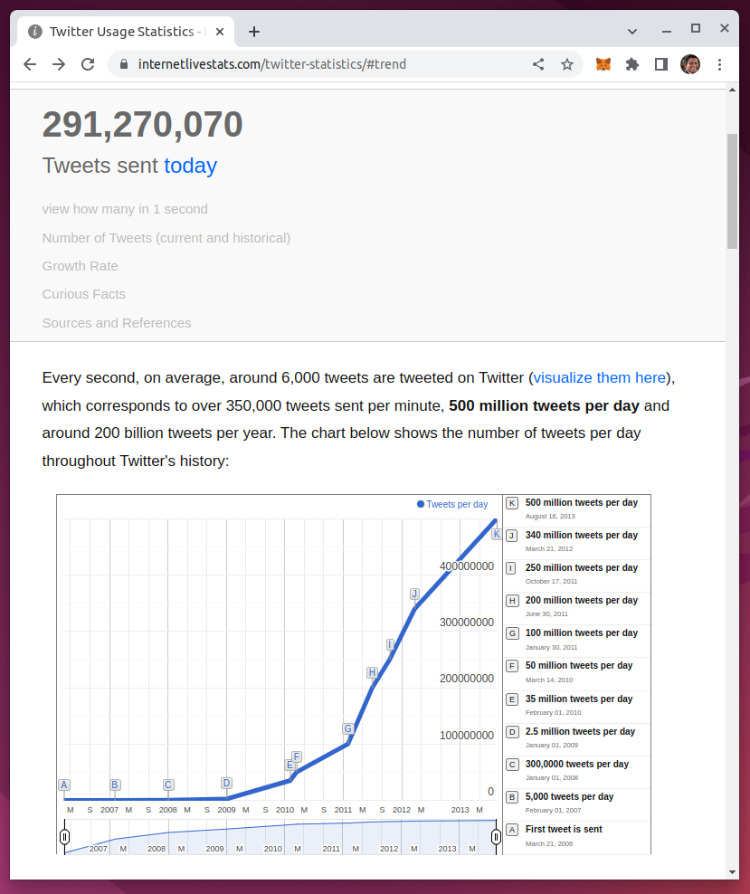
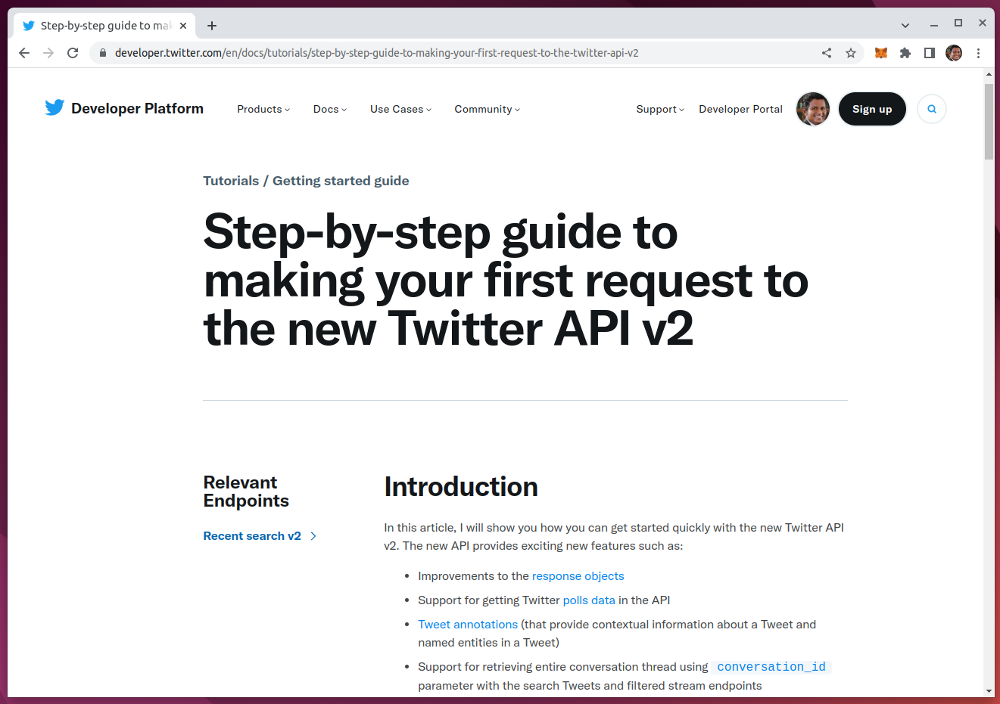
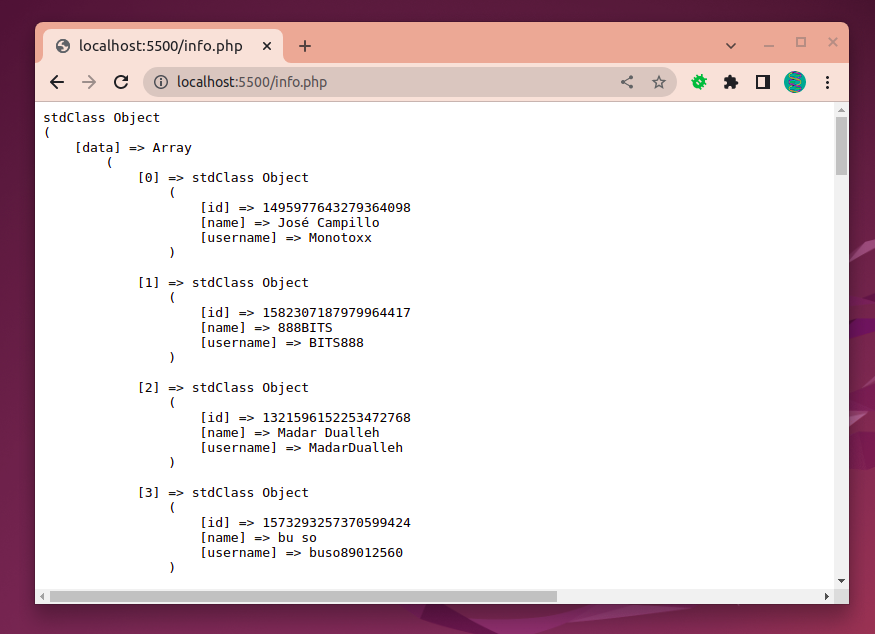

# 500 Million Tweets Per Day

# Twitter API v2

https://developer.twitter.com/en/docs/twitter-api/getting-started/about-twitter-api

# Bird Elephant

https://birdelephant.com/

## Connect to Twitter API v2 endpoints in PHP.

This package provides a number of useful ways to interact with the Twitter Rest API v2 endpoints in PHP. It provides a clean and easy to understand set of methods and classes to send tweets, manage users, lookup data, and everything else that the Twitter API v2 provides, from within your app or site.

# Twitter Followers and Following

